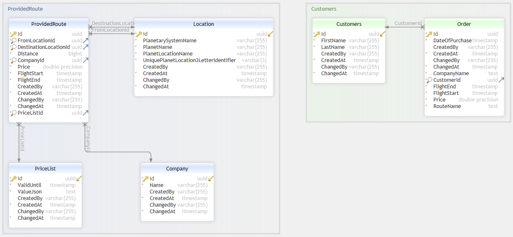

# Cosmos Odyssey

## Setup
1. Clone the project `git clone https://github.com/oskar-anderson/CosmosOdyssey`.
2. Insert your database connection string. 
Create file named `appsettings.secret.json` based on `appsettings.secret.template.json` structure (`cp webapp/appsettings.secret.template.json webapp/appsettings.secret.json`).
Insert your PostgreSQL database connection string.
3. `dotnet build`
4. `dotnet run --project WebApp`
5. Open http://localhost:5058

## Description

### Database schema:
Database schema ERD:



There is support for seeding Location and Company data from CSV files to database.
Data is viable with LibreOffice (Excel is very bad for CSV files, recommended to use LibreOffice instead) in Data directory.
That directory along with all its content is loaded to WebApp project compilation directory and then parsed by the running app.
CSV file format is delimited by ',', all fields are always escaped by '"'.

When you are ready to seed data change `appsettings.json` AppDataInitialization properties to `true`
```
"AppDataInitialization": {
  "DropDatabase": true,
  "MigrateDatabase": true,
  "SeedData": true
},
```

### Architecture
Basically database `DbContext` interacts with `Domain` objects (`Domain` objects = database table = `DbSet`).
Repositories access Domain data through `DbSet` and map it to `DAL.DTO` objects before returning the result to web controllers.

Project layers:
* DAL - Layer 2 (knows how to query the database)
    * Contracts.DAL.App - Interfaces for repository methods
    * Contracts.DAL.Base - Base interfaces inherited by all `Contracts.DAL.App` interfaces.  This provides some basic functionality to all repositories assuming entities all have inherited ID property.
    * DAL.App.DTO - DTO objects returned to controllers
    * DAL.App.EF - Knows how to generate the database schema using `AppDbContext` class. Contains EF (Entity Framework ORM) database migration based on changes to `Domain` objects. Also contains concrete Repository implementations based on `Contracts.DAL.App` interfaces.
    * DAL.Base.EF - Implements `Contracts.DAL.Base`
* Domain - Layer 1 (innermost layer - database models)
    * Contracts.Domain - metadata interfaces for data objects
    * Domain.App - Contains the actual models database schema is based on. These objects can be inserted to the database.
    * Domain.Base - Implementations of `Contracts.Domain`
* Mapper - All manual data mapping between layers
* WebApp - ASP.NET MVC frontend logic controllers. The actual visible app.
* WebDTO - Additional models


## Packages
* Microsoft.EntityFrameworkCore - Base ORM package (DbContext)
* Npgsql.EntityFrameworkCore.PostgreSQL - EntityFramework Driver for Postgres database
* Microsoft.EntityFrameworkCore.Design - Needed for database schema generation with `dotnet ef migrations add ...` command otherwise error (Your startup project 'WebApp' doesn't reference `Microsoft.EntityFrameworkCore.Design`. This package is required for the Entity Framework Core Tools to work.)
* Microsoft.EntityFrameworkCore.Relational - EntityFrameworkCore extension package for relational databases. Needed for migrations (Microsoft.EntityFrameworkCore.Migrations (comes with Microsoft.EntityFrameworkCore package) relies on it).
* Microsoft.EntityFrameworkCore.Abstractions - precision attribute for EF decimal datatype
* Microsoft.Aspnetcore.Diagnostics.EntityFrameworkCore - builder.Services.AddDatabaseDeveloperPageExceptionFilter();
* System.Net.Http.Json - Convenience method to allow deserialization of httpClient request
* Microsoft.AspNetCore.Mvc.ViewFeatures - SelectList
* Identity (Unused):
  * Microsoft.Aspnetcore.Identity.UI - .AddDefaultIdentity()
  * Microsoft.Aspnetcore.Identity.EntityFrameworkCore - .AddEntityFrameworkStores()

## Commands
Database related (run in solution folder)
~~~
dotnet ef migrations add DbCreation4 --project DAL.App.EF --startup-project WebApp
dotnet ef database update --project DAL.App.EF --startup-project WebApp
dotnet ef database drop --project DAL.App.EF --startup-project WebApp
~~~

## Other:
https://guidgenerator.com/online-guid-generator.aspx
